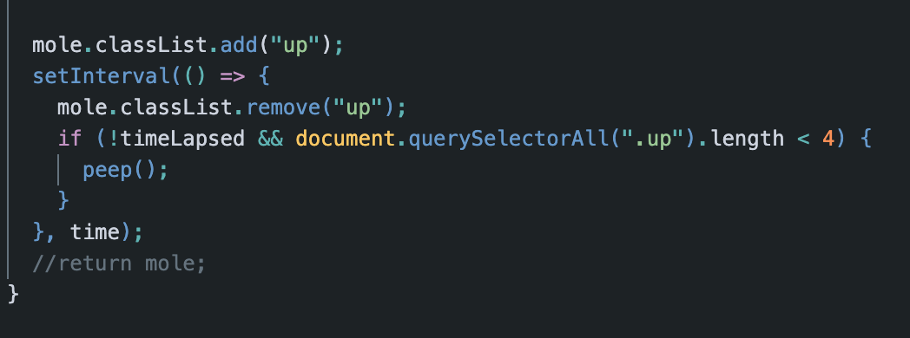

# Poke-whack-AR

We watched Wes Bos's Whack-A-Mole [video](https://www.youtube.com/watch?v=toNFfAaWghU&list=PLu8EoSxDXHP6CGK4YVJhL_VWetA865GOH&index=30) and recreated the functions from memory, to create our own version of the game.

We used a Pokemon API to get the mole image. 

## Issues

We added an alert which then kept repeating, so in order to stop this, we added a clearInterval() to the function.

We had too many moles appearing at one time, giving the appearance of it speeding it up. We added a factor to the if statement that limited to number of moles popped up to less than 4.

